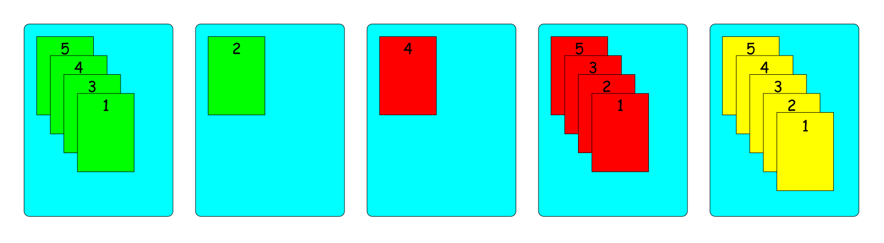

# AI Projects

AUT Principles and Applications of Artificial Intelligence course (Fall 2020) projects.


## Table of Contents

1. [Simple Card Game! Search problem using BFS, IDS, and A* algorithms](#1-simple-card-game-search-problem-using-bfs-ids-and-a-algorithms)
2. [Colorful Sudoku: CSP problem using Backtrack algorithm with Forward Checking and MRV and Degree heuristics](#2-colorful-sudoku-csp-problem-using-backtrack-algorithm-with-forward-checking-and-mrv-and-degree-heuristics)
3. [Poet Recognition: NLP problem using Unigram, Bigram, and Backoff models](#3-poet-recognition-nlp-problem-using-unigram-bigram-and-backoff-models)


------

### 1. [Simple Card Game! Search problem using BFS, IDS, and A* algorithms](https://github.com/radinshayanfar/AI_Projects/tree/master/PRJ1_PRJ2/src/main/java/prj1)

In this exciting game, there are multiple cards with different numbers and colors. We have `M` colors for cards, and for each color, there are `N` cards numbered from 1 to `N`. The cards could be placed in any of `K` available columns, and all of them are visible at any time. **The goal is to arrange the cards so that all cards in every column have the same color and are sorted in descending order**. Also, there is a rule for moving the cards. You can only pick a card from the top of each column, and it should be placed on a card with a greater number.

For instance, an initial state can be as follows:


In the above example, a possible move is to pick the yellow-2 card from the second column and put it on the fourth column. So the game state would be:


Other possible destinations for yellow-2 are the first column and fifth (empty) column. But notice that it cannot be moved to the third column (as the card underneath it will not be greater than that).

So in this project, given the initial state, a goal state could be found using BFS (BFSMain class), IDS (IDSMain class), or A* (AStarMain class) search algorithm.

#### Input

The first line contains `K M N`, number of columns, colors, and cards for each color, respectively.

Each next `K` lines inputs each column card. Cards are separated by space and characterized by a character (defining card color) followed by a number (defining card number). `#` determines an empty column.

**Sample input:**

The above example initial state is as follows:

```
5 3 5
5g 5r 4y
2g 4r 3y 3g 2y
1y 4g 1r
1g 2r 5y 3r
#
```

#### Output

The goal state, problem statistics such as goal depth and created noes, and steps to reproduce the goal state will be printed.

A possible answer to the above input using A* algorithm is:

```
5g 4g 3g 1g
2g
4r
5r 3r 2r 1r
5y 4y 3y 2y 1y
========
Depth: 22
Created nodes: 2066067
Expanded nodes: 427019
========
Actions:
3 => 2
4 => 3
4 => 5
4 => 3
1 => 5
4 => 5
1 => 4
3 => 1
3 => 4
1 => 4
2 => 4
3 => 1
3 => 1
2 => 3
1 => 3
2 => 1
5 => 1
2 => 5
3 => 2
3 => 5
2 => 5
2 => 3
```

which is illustrated in the image below:




#### Full description

Read the full description (in Persian) [here](https://github.com/radinshayanfar/AI_Projects/blob/master/instructions/AI_P1.pdf).

The report for this project (also in Persian) is [here](https://github.com/radinshayanfar/AI_Projects/blob/master/report/prj1/report.pdf).


------

### 2. [Colorful Sudoku: CSP problem using Backtrack algorithm with Forward Checking and MRV and Degree heuristics](https://github.com/radinshayanfar/AI_Projects/tree/master/PRJ1_PRJ2/src/main/java/prj2)

Here we have an advanced n-Sudoku game: n-Sudoku with colors! In this game, each cell has color in addition to the numbers we had in the classic n-Sudoku game. The colors also have priorities over each other. These priorities are inputted into the program.

So the rules are:

1. Each cell should both a number and a color assigned to it.
2. Each number should be unique in its row and column.
3. For every two adjacent cells, the following statement should be the case: "If a cell has a greater number than its adjacent, then its color should have more priority over that adjacent and vice versa."

For instance, consider the below color priorities and initial state:


**Red > Green > Blue > Yellow > Purple**


The project tries to solve the problem (formulated as a CSP problem) using Backtrack algorithm with Forward Checking and MRV and Degree heuristics.

#### Input

The first line contains `M N`, number of colors and dimension of table, respectively.

Each next `N` lines inputs each row's cells' numbers and colors. Cells are separated by space and characterized by a number (defining cell number) followed by a character (defining cell number). `#` determines an empty column. We use `*` to denote a cell with no number and `#` to denote a cell with no color.

**Sample input**

The above example initial state is as follows:

```
5 3
r g b y p
1# *b *#
*# 3r *#
*g 1# *#
```

#### Output

The solved game (if possible) will be printed out.

A possible answer to the above input using A* algorithm is:

```
1y 2b 3g
2b 3r 1y
3g 1y 2g
```

which is illustrated in the image below:


#### Full description

Read the full description (in Persian) [here](https://github.com/radinshayanfar/AI_Projects/blob/master/instructions/AI_P2.pdf).

The report for this project (also in Persian) is [here](https://github.com/radinshayanfar/AI_Projects/blob/master/report/prj2/report.pdf).


------

### 3. [Poet Recognition: NLP problem using Unigram, Bigram, and Backoff models](https://github.com/radinshayanfar/AI_Projects/blob/master/prj3/prj3.ipynb)

In this NLP problem, given a line from Ferdowsi, Hafez, or Molana (three famous Iranian poets), the aim was to predict that line's author. To achieve this goal, a Unigram and a Bigram model trained on a train set with over 24 thousand lines of poems written by these three poets. Also, the following Backoff model was used for smoothing:


#### Full description

Read the full description (in Persian) [here](https://github.com/radinshayanfar/AI_Projects/blob/master/instructions/AI_P3.pdf).
